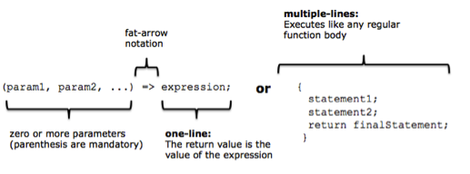
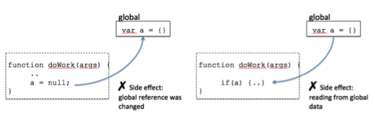
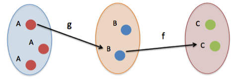
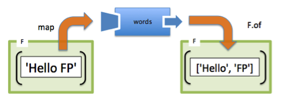

## Hello FP!

Functional programming is a software paradigm that will radically change the way in which you approach any programming endeavor. This is evident in this simple example:

```js
document.getElementById('message').innerHTML = '<h1>Hello FP!</h1>';
```

While this program is very trivial, without any effort, it can quickly become problematic. What if you wanted to change the formatting from an `<h1>` to an `<h2>`? Or change the target element? Inevitably, you would have to rewrite this statement again.

Consider wrapping it all inside a function and making these data points function parameters. Let’s explore this further, but instead of using one big function, we’ll create smaller functions and combine them all with a function called compose:

```js
compose(addToDom, h1, echo('Hello FP!'));
```
Combining simple functions to create more meaningful programs is the central theme of functional programming. It also creates very extensible code as I can easily swap any function (like h1 for an h2) without running the risk of breaking other parts of the program. What is compose? There’s a lot more to cover to understand this, so let’s dive in!

If you’re feeling adventurous, you can play with this program here: http://jsbin.com/guwiji/edit?html,js,output.

## Why JavaScript?

The answer is simple: omnipresence. JavaScript is a dynamically typed, object-oriented, functional, general purpose language that contains an immensely expressive syntax. It’s one of the most ubiquitous languages ever created and can be seen in the development of mobile applications, websites, web servers, desktop and embedded applications, and even databases.

From its ancestors Lisp and Scheme, JavaScript inherits higher order functions, closures, array literals, and other features that make JavaScript a superb platform for applying functional programming techniques. In fact, functions are the primary “unit of work” in JavaScript.

This article assumes a good understanding of JavaScript, but here are some points to consider:

### Lambda Expressions

Known as fat arrow functions in the JavaScript world, lambda expressions encode simple one-line anonymous functions with shorter notation compared to traditional function declaration. You could have lambda functions of multiple lines, but one-liners are the more common use case. Here’s a simple example of a function used to add 2 numbers:

```js
const add = (a, b) => a + b;
add(2, 3); //-> 5
```

[]()

### Higher order Functions

In JavaScript, functions are first-class objects, which means they can be used in a first-class manner just like any other object. Hence, you can intuitively expect that functions
can be assigned to variables, passed in as parameters, and returned from other functions. This versatility is what gives JavaScript functions the title of higher order functions.

```js
// assign function to variable
const multiplier = (a, b) => a * b;
// pass function as argument
const applyOperation = (a, b, opt) => opt(a, b);
applyOperation (2, 3, multiplier); //-> 6
// return functions from other functions
function add(a) {
  return function (b) {
    return a + b;
  }
}
add(3)(3); //-> 6
```

You can try out higher order functions here: http://jsbin.com/ kiruba/edit?js,console.

### Closures

A closure is a data structure that binds a function to its environment at the moment it’s declared. It is based on the textual location of the function declaration; therefore, a closure is also called a static or lexical scope surrounding the function definition. Because closures give functions access to its surrounding state, you can solve many problems in a terse and concise way.

*For a thorough exploration of JavaScript, try reading* [Secrets of a JavaScript Ninja 2nd Edition](https://www.manning.com/books/secrets-of-the-javascript-ninja-second-edition) (Manning 2016).

### Does functional programming replace object-oriented?

It’s important to know that JavaScript is as functional as it is object-oriented—and both of these are useful for implementing mid-to-large size applications. The good news is that functional programming and object-oriented programming are not mutually exclusive and can be used simultaneously. In fact, platforms like Scala and F# have blended both paradigms successfully into a single language, making them very pragmatic and geared towards productivity. JavaScript is another hybrid language that provides the freedom to use these orthogonal paradigms in the same code base.

## Functional Programming

Functional programming is a software development style that emphasizes the use functions. Its main purpose is to abstract control flow and operations on data with functions in order to avoid side effects and reduce mutation of state in your code.

There is a small set of very important concepts—borrowed from mathematics—that form the backbone of all functional programming.

### Pure Functions

In order to understand functional programming, you must first understand functions in the mathematical sense as being a mapping of types. The set of a function’s input values is called the domain and the set of possible values returned is the range. Visually:

[]()

Simply, the function `isEmpty` used to validate whether a string has length zero is a mapping from `String` to `Boolean`. This is written as:

```js
isEmpty :: String -> Boolean
```

Functional programming is based on the premise that you will build immutable programs solely based on pure functions. A pure function has the following qualities:

- It depends only on the input provided and not on any hidden or external state that may change as a function’s evaluation proceeds or between function calls.
- It does not inflict changes beyond its scope (like modifying a global object or a parameter reference).
Both points refer to the presence of side effects in your code; behavior that is to be avoided at all costs:

[]()

The concept of pure functions leads into another concept in functional programming: referential transparency.

### Referential Transparency

Referential transparency (RT) is a more formal way of defining a pure function. Purity in this sense refers to the existence of a pure mapping between a function’s arguments and its return value. Hence, if a function consistently yields the same result on the same input, it is said to be referentially transparent. The multiplier and adder functions shown earlier were RT. Here’s an example of a non-RT program:

```js
const nums = [80, null, 90, 100];
const total = 0;
const validNums = 0;
function average() {
  // Depends on the external variable nums, total, validNums
  for (let i = 0; i < nums.length; i++) {
    if (nums[i] !== null || nums[i] !== undefined) {
      total += nums[i];
      validNums++;
    }
  }
  const newAverage = total / validNums;
  return Math.round(newAverage);
}
```

The problems with this program are due to its exposure to side effects by relying on external variables: `nums`, `total`, and `validNums`. If any of these variables change in between calls to `average`, it yields different results.

RT exercise: http://jsbin.com/lipewu/edit?js,console.

## Functional Techniques

Functional programming contains a set of very compelling techniques that drive your application’s control and data flow. Pure functional programs have many of these techniques built into them, such as automatic currying (which we’ll see in a bit). Unfortunately, JavaScript doesn’t. Now, this doesn’t mean you can’t use JS functionally. In fact, because JavaScript has support for closures and higher order functions, you can very easily extend the platform via functional libraries to support all of the most important functional techniques you’ll need.

### Away with loops!

A noticeable quality of functional programs is the absence of the standard looping mechanisms: `for`, `while`, and `do-while`. The reason here is that pure functional programs don’t mutate variables (like a loop counter) after they've been initialized. Instead, we will take advantage of higher order functions—like: `forEach`, `map`, `reduce`, and `filter` to abstract iteration schemes, which also help us remove a few if-else conditionals while we’re at it. JavaScript has native implementations of these functions, but it’s worth considering the implementations provided in the library `Lodash.js`, as they are more extensible.

You can download Lodash.js here: https://lodash.com.

Lodash.js defines a global object wrapper `_` (an underscore), which can be used to unlock all of its functionality, starting with `_.forEach`:

#### <span class="normal-case">_.forEach</span>

This function iterates over the elements of a collection, invoking the provided iteratee function on each one. The callback function is supplied 3 arguments: value, index, and array.

```js
_.foreach([80, 90, 100], function(value) {
  setTimeout(function() {
    console.log(value);
  }, 100);
}).value();
```

Aside from not having to keep track of loop counters and array length, `_.forEach` also makes your code more declarative and easier to understand. Also, because the body of the loop is encapsulated inside a function, it properly binds each loop value into the callback’s parameter, avoiding some of those nasty scoping JavaScript bugs.

#### <span class="normal-case">_.map</span>

Mapping functions onto containers is an important part of functional programming. For arrays, I can use a mapping function to transform its contents into an array of similar length as the original, while keeping the original intact. The `_.map` function also has the built-in feature of skipping nulls, so it saves us from having to manually do if-else null checks.

The function supplied to `_.map` is invoked with the same arguments as `_.forEach`. Given a function:

```js
const toLetter = function (grade) {
  if(grade >= 90) return 'A';
  if(grade >= 80) return 'B';
  if(grade >= 70) return 'C';
  if(grade >= 60) return 'D';
  return 'F';
};
```

We can transform a list of numerical grades into letter grades:

```js
_.map([20, 98, 100, 73, 85, 50], toLetter);
//-> [F, A, A, C, B, F]
```

#### <span class="normal-case">_.filter</span>

Filter transforms an array by mapping a predicate function (function with a boolean return value) onto each element. The resulting array is made up of, potentially, a subset of elements for which the predicate returns true.

```js
_.filter(['Spain', 'USA', 'Serbia', 'Uganda'], (name) => name.substring(0,1) === 'S');
//-> [Spain, Serbia]
```

The function supplied to `_.filter` has the same arguments as `_.map`. As you can see from the code above, `_.filter` abstracts the task of performing an if-else check to remove elements from the array, where the condition clause is encoded as the predicate function.

#### <span class="normal-case">_.reduce</span>

Typically used as a terminal operation originating from `_.map`, `_.reduce` can be used to fold or gather the contents of an array by compressing it into a single value. Each successive invocation is supplied the return value of the previous. `_.reduce` is typically seen as combined with `_.map` and `_.filter`:

The accumulator function is supplied the current running total (or accumulated value), the current value, index, and the array.

Map, reduce, filter exercise: http://jsbin.com/cihuyo/edit?js,console.

#### Function Chaining

Functions like map, filter, and reduce are just a few of an entire library of functions in Lodash. In fact, all functions in Lodash are designed to be chainable, starting with `_.chain()`:

```js
const users = [
  { 'user': 'Haskell', 'birth': 1900 },
  { 'user': 'Turing', 'birth': 1903 },
  { 'user': 'Rosser', 'birth': 1907 }
];
const youngest = _.chain(users)
  .sortBy('birth').last()
  .value(); //-> Rosser
```

Chaining functions this way leads to very declarative code, which describes what the program should do rather than how it does it. Function chains allow you to describe the parts of your application without actually running it. Only when the last function `_.value()` is invoked does evaluation actually occur.

#### Recursion

Recursion has many uses in software, especially when solving self-similar types of problems such as traversing trees or mathematical progressions like Fibonacci. It turns out recursion can also be extremely effective at traversing any type of sequential data structures such as arrays, which is why it’s become the de facto iteration mechanism in functional languages.

Traversing arrays recursively originates from realizing arrays are self-defined as collections, each having a head and a tail, both available as Lodash operations. Here’s a quick example of a sum function to add all of the elements in an array.

```js
function sum(arr) {
  const list = _(arr);

  return list.isEmpty() ? return 0 :
    list.head() + sum(list.tail());
}
sum([]); //-> 0
sum([1,2,3,4,5,6,7,8,9]); //->45
```

The main benefit of recursion is that you can loop in an immutable manner since there’s no explicit loop counter to update. Hence, the responsibility of moving through the elements in an array is ceded entirely to the language runtime.

### Function Abstractions

Functional programming provides very powerful abstractions that allow you to create functions from the definition of other functions or to augment the evaluation of existing functions. The first abstraction we’ll talk about is `_.curry`.

#### Currying

Currying is a technique that converts a multivariable function into a step-wise sequence of unary functions. In other words, a function with parameters: `f(a, b, c)` is internally augmented to one that works on parameters one at a time: `f(a) -> f(b) -> f(c)`. Consider the case of a function name that returns first and last name:

```js
// name :: String -> String -> String
const name = function (first) {
  return function (last) {
    return `${last}, ${first}`
  }
}
```
Instead of writing it like this, we can use Lodash’s automatic currying functionality:

```js
const name = _.curry(function(last, first) {
  return [last, first].join(',');
});

// When supplied both arguments, it evaluates the function immediately
name('Curry')('Haskell'); //-> 'Curry, Haskell'

// When supplied one argument, it returns another function
name('Curry'); //-> Function
```

As you can see from the example above, `name` is a function of two arguments. From this curried version, a family of functions is born by partially applying only the first argument:

```js
const curry = name('Curry');
curry('Haskell'); //-> 'Curry, Haskell'
curry('Samuel'); //-> 'Curry, Samuel'
curry('Anna'); //-> 'Curry, Anna'
```

Currying exercise: http://jsbin.com/dubaqa/edit?html,js,console.

This idea of partially applying arguments has another modality, known as partial application.

#### Partial Application

Partial application is an operation that binds a subset of a non-variadic function’s parameters to fixed values, creating a function of smaller arity. This is especially useful when implementing presets or default function arguments. Consider the following log function:

```js
function log (level, target, message)
```

I can use this function to log a message with different levels and target either the console or an alert box. Using `_.partial`, I can create an `infoConsoleLogger`, for example:

```js
const infoConsoleLogger = _.partial(log, 'console', 'INFO');
infoConsoleLogger('Users name ' + name('Curry', 'Haskell'));
```

Partial application can also be used with placeholders `_` to extend language with native behavior. Consider these two examples:

```js
// Take the first N characters of a String
String.prototype.first = _.partial(String.prototype.substring, 0, _);
'Functional Programming'.first(3); //-> 'Fun'
// Convert any name into a Last, First format
String.prototype.asName = _.partial(String.prototype.replace, /(\w+)\s(\w+)/, '$2, $1');
'Alonzo Church'.asName(); //-> 'Church, Alonzo'
```

Both currying and partial application are extremely useful when combined with composition.

#### Composition

Composition is the process used to group together the execution of simpler functions. In essence, composition is a function derived from other functions.

The composition of 2 functions `g` and `f` (read `f` composed of `g`) is given by:

```js
f · g = f(g) = compose :: (B -> C) -> (A -> B) -> (A -> C)
```

You can visualize the composition of two functions as a mapping of sets linking their inputs and outputs:

[]()

In simple terms, this means the output of `g` will be passed into the input of `f`. Let’s see this in action using Lodash’s `_.compose`:

```js
const str = "We can only see a short distance ahead but we can see plenty there that needs to be done";
const explode = (str) => str.split(/\s+/);
const count = (arr) => arr.length;
const countWords = _.compose(count, explode); //-> 19
```

Because functions have single return values, it’s imperative for the function receiving the input (in this case f) to behave as a unary function. This is where currying is so useful, as it can be used to reduce a function’s parameters to one. Let’s expand on the example shown previously; this time we will determine if a block of text contains 10 words:

```js
const check = _.curry((len, size) => size >= len);
const check10 = check(10);
const checkText = _.compose(check10, count, explode);
checkText(str); //-> true
```

Currying and composition exercise: http://jsbin.com/fokixa/edit?html,js,console.

## Functional Data Types

Currying and composition provide abstractions over functions - the drivers for behavior in your application. Functional data types like functors and monads provide abstractions over the data. Functional data types part from the notion of mapping functions onto containers. You saw this earlier with the `_.map` function on arrays. In a similar manner, we can map functions over any type.

### Containerizing

The idea behind containerizing is very simple but has far reaching applications. The goal is to place values in a container. By doing this, we hope to create a logical barrier that promotes transforming values immutably and side-effect free. Let’s define our simple container type, `Wrapper`:

```js
const Wrapper = function(val) {
  this.val = val;
};
Wrapper.prototype.map = (f) => f(this.val);
const wrap = (val) => new Wrapper(val);
```

Once we wrap a value, the rule is that you can only map functions onto it to transform and retrieve it. Let’s see an example:

```js
const msg = 'Hello FP!';
wrap(msg).map(_.words); //-> ['Hello', 'FP!']
```

This idea is rather simple: you put the value into a container and run a function over it. We can make this more powerful if we could continue mapping functions over the container multiple times, just like map. Consider this variation of `Wrapper.map`:

```js
Wrapper.prototype.map = function(f) {
  return wrap(f(this.val))
}
```

As you can see now, aside from mapping the function over the value, the result is placed back into the container, which allows for a chainable sequence of operations to take place:

```js
const msg = 'Hello FP!';
wrap(msg).map(_.words).map(_.size); //-> Wrapper(2)
```

You should realize that the original wrapped object was never actually touched, and not because it’s a string, but because mapping functions over the value always returns a new value, leaving the original unaltered.

### Functors

That’s right, the array map is a functor since you can map a function onto its elements and the result is again an array. In essence, a functor is nothing more than a type that implements a mapping function with the purpose of lifting values into a container. Hence, a functor `F` defines a mapping function as follows:

```js
F.prototype.map = function(f) {
  return F.of(f(this.val))
}
```

The function F.of is nothing more than a way to instantiate the data type without having to call new. Diagraming the example code above:

[]()

Functors are important because they introduce the idea of a function “reaching” into the container, modifying it, and placing the value “back into” it. As is, however, this wrapper doesn’t provide much more value. For instance, what happens if I wrap a null object and attempt to map functions over it?

Functor exercise: http://jsbin.com/tetet/20/edit?html,js,console.

### Monads

Monads are data types similar to functors, but they also define the rules by which values are contained within them. The monad type, as such, is an abstract data type with the following interface:

INTERFACE | DESCRIPTION
| --- | --- |
Type constructor | Used for creating monadic types
Unit function | Used for inserting a value into a monadic structure. Typically called `of` or `fromNullable`
Bind function | Used for chaining operations on monadic values, called `map`
Join operation | Used to flatten layers of monadic structures into one. Important when used in the composition of functions that return monadic types

Monadic types are concrete implementations of this interface. In practical programming problems, monadic types are frequently seen to abstract and consolidate null checks and error handling. The two most frequently used are the `Maybe` and `Either` types.

#### Maybe

The `Maybe` monad can be used to model the presence or absence of a value (`null` or `undefined`) in a centralized and secure manner.

Implementation details can be found at: https://github.com/folktale/data.maybe.

This data type is an abstract type with 2 concrete implementations:

TYPE | DESCRIPTION
| --- | --- |
Just(val) | Always contains a valid value
Nothing() | Represents a container that has no value, or the case of a failure with no additional information

Let’s see this in action:

```js
const user = {name: 'Haskell Curry', age: 14};
Maybe.fromNullable(user)
  .map(_.property('age'))
  .map(add(1)); //-> Maybe(15)
```

`Maybe` receives an object, and sets out to perform a couple of transformations: extracting the `age` property and then adding `1` to it. But what would happen in the case of `null`?

```js
Maybe.fromNullable(null)
  .map(_.property('age'))
  .map(add(1)); //-> Nothing()
```

This is the remarkable thing: `Nothing` happens. `Maybe` has provided specific logic in its unit function that abstracts null checks from your code. This monad can also be used to abstract out nested if-else statements present in imperative code. Consider this example:

```js
function getCountry(student) {
  const school = student.getSchool();
  if (school !== null) {
    const addr = school.getAddress();
    if (addr !== null) {
      return addr.getCountry();
    }
  }
  return 'Country does not exist!';
}
```

Watch how this code becomes much more streamlined using `Maybe`:

```js
const getCountry = (student) => {
  return Maybe.fromNullable(student)
    .map(_.property('school'))
    .map(_.property('address'))
    .map(_.property('country'))
    .getOrElse('Country does not exist!');
}
```

#### Either

`Either` represents a logical disjunction (OR) between two values `a` and `b`, but never at the same time. Unlike `Maybe`, `Either` can be used to signal a failure in your code and provide a possible recovery route. It also has two concrete implementations:

TYPE | DESCRIPTION
| --- | --- |
Left(a) | Can contain a possible error message or an exception to throw
Right(b) | Always contains the successful value (known as biased on the right)

Implementation details of Either can be found here: https://github.com/folktale/data.either.

Consider this example to look up strings by some key:

```js
const messages = {
  'welcome': 'Hello FP!'
};
const lookUp = function (obj, key) {
  const str = obj[key];
  if (str) {
    return Either.fromNullable(str);
  }
  return Either.Left('String not found!');
};
```

Here’s the work of the monad in the event of valid and invalid cases:

```js
// valid
lookUp(messages, 'welcome').map(_.words); // Right(['Hello', 'FP!'])
// invalid
lookUp(messages, 'badKey').map(_.words); // Left('String not found!');
```

With both `Maybe` and `Either`, even if the function fails to look up a value, I can still map functions onto them, safely propagating and securing the error until reaching the end of the expression.

Now try it for yourself: http://jsbin.com/juluka/edit?html,js,console.

## Interacting With the DOM

Since functional programming must be pure and side-effect free, how do you interact with the DOM? Reading from or writing to the DOM are severe causes of side effects in your code since your functions are accessing and modifying a globally shared resource. While we can’t avoid side effects from occurring, we can at least write code that behaves in a referentially transparent way in the face of HTML reads and writes. Let’s begin there. I will define two simple operations: read and write:

```js
const read = function (id) {
  return function () {
    return document.getElementById(id).innerHTML;
  };
};
const write = function(id) {
  return function(value) {
    document.getElementById(id).innerHTML = value;
  };
};
```

The purpose of creating these curried functions is two-fold:

- To isolate the IO operations into singular functions as much as possible.
- To control their side effects when used with the IO monad.

### IO Monad

As the name suggests, we have a monad that allows us to do pseudo-side-effect free IO. This monad is mainly in charge of separating the IO operations from the main logic of your code. Let’s look at a quick example, given the following HTML div:

```js
<div id='message'>Hello FP!</div>
const performUnsafeIO = IO.from(read('message'))
  .map(_.snakeCase)
  .map(write('message'));
```

As is, this expression doesn't effect any change. This is because the IO monad is nothing more than a referentially transparent program description. All of the side effects are executed in one shot with a call to `IO.run`:

```js
performUnsafeIO.run();
// HTML output
<div id='message'>hello_fp</div>
```

Try out the IO monad: http://jsbin.com/butame/edit?html,js,output.

## Conclusion

To sum up, functional programming is a paradigm with a radically different philosophy from traditional object-oriented development. The main distinctions are apparent when considering functional programming’s declarative mode of expressing code, as well as its focus on preserving immutability through functions that execute in a side-effect free environment.

At the core of functional programming lies functional composition and monads. Composition provides function abstractions used to create complex functions from simple ones. While composition abstracts control flow, monads abstract data. Monadic types provide a secure layer where invalid data is guarded from causing your code to fail.

The biggest challenge of large JavaScript application development is dealing with the complexity inherent in the level of flexibility and dynamicity that the language provides. The principles behind functional programming can be used to remedy this and prevent your code from being impacted by other scripts loaded onto the same page, leading to code that is much easier to read, test, and reason about.

With the aim of being terse and expressive, functional programming is a paradigm that can boost your development productivity and create more robust applications.

---

**SOURCES**

- LUIS ATENCIO. Functional Programming in JavaScript on [DZone](https://dzone.com/refcardz/functional-programming-with-javascript)

**RECOMMENDED BOOK**

[Functional Programming in JavaScript](https://www.manning.com/books/functional-programming-in-javascript?a_bid=09ffe2cc&a_aid=latenciofpjs) teaches JavaScript developers functional techniques that will improve extensibility, modularity, reusability, testability, and performance. Through concrete examples and jargon-free explanations, this book teaches you how to apply functional programming to real-life development tasks. By the end of the book, you'll think about application design in a fresh new way.
