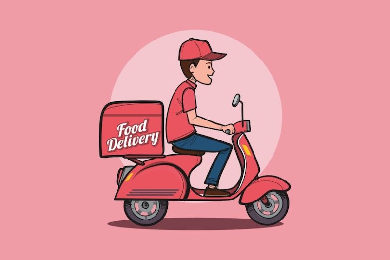

ID | Description
---|------------
Timeline | Aug 2018 - Sep 2018
Domain | Food Delivery, Restaurant, Startup
Delivery model | Onsite
Team size | 4 developers
Location | Bangkok, Thailand
Role | Mobile Tech Lead, React Native Developer

## Overview
The food delivery service sector plays a major role in society by providing a platform to order meals with a click of a button and is challenged to meet their customer demand for more sustainable food choices.

To learn more about this market and support a new business to enter the market, we conduct a market survey, analysis and evaluation of solutions. Along with that is the construction of a food delivery service (web & mobile apps), serving customers, drivers, restaurants and call centres. The system will focus on optimizing the delivery time based on smart algorithms so that food can quickly reach customers, reduce shipping costs and increase customer satisfaction.

## Tech Stack
- React Native, Redux, React Navigation, Expo
- Functional JS, Ramda, Recompose
- Glamarous Native, i18n, Formik, Design System
- Jest, Enzyme
- Typescript, Type System
- GraphQL, Graphcool
- TSLint, Prettier
- Gitlab, CI/CD
- Zeplin, Retool

## Responsibilities
- Define code structure & front-end architecture
- Document code convention & principles
- Conduct team training & pair programming sessions
- Work on Front-end development with React Native
- Interact with the backend and design team members
- Responsible for code reviews & writing testable code
- Take part in continuous integration, git collaboration, problem-solving and new business ideas
- Collaborated to define the product; interface with many stakeholders to drive product decisions
