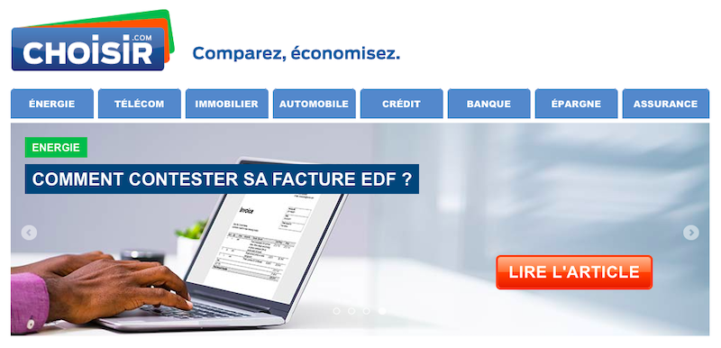

| Info           | Description                        |
| -------------- | ---------------------------------- |
| Timeline       | Jun 2014 – Sep 2014                |
| Domain         | Advertising                        |
| Delivery model | Offshore                           |
| Location       | HCMC, Vietnam                      |
| Role           | PHP Developer, FullStack Developer |

## Overview

A responsive website that guides how to choose a good product in many sectors:

- Automation
- Credit
- Banking
- Automation
- Telecom
- Real estate

## Tech Stack

PHP, Drupal, CSS, HTML, JavaScript, CoffeeScript, Grunt
