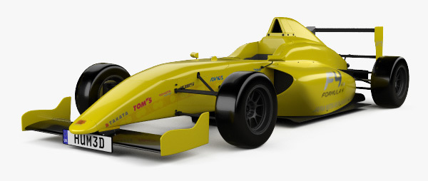

| Info           | Description            |
| -------------- | ---------------------- |
| Timeline       | Mar 2016 – Jun 2016    |
| Domain         | Racing, Social-Network |
| Delivery model | Offshore               |
| Team size      | 6 developers           |
| Location       | HCMC, Vietnam          |
| Role           | Frontend Developer     |

## Overview

FIA wants to create a platform to gather all the drivers from these 12 championships and especially aims 3 targets:

- Create a community of young drivers (15-19 years old) where they could interact with each other. Through this platform, young drivers could speak about different sports activities by posting videos and interviews.
- Promote F4 FIA with the different actors of the industry: young drivers 12-14 years old, team managers, audience, fans, other championships, etc.)
- Collect data about the drivers that FIA would reuse in the near future.

## Tech Stack

- Backend: CentOS, Varnish (Load Balancing, HTTP Reverse proxy, Cache), Nginx, Apache, PHP, Drupal, MySQL, Solr
- Frontend: ReactJS, NuclearJS, MeteorJS, Gulp, Webpack

## Highlights

- Work on frontend development using ReactJS and MeteorJS
- Build the backend structure based on Node.js best practices
- Perform code review
- Work with many stakeholders
