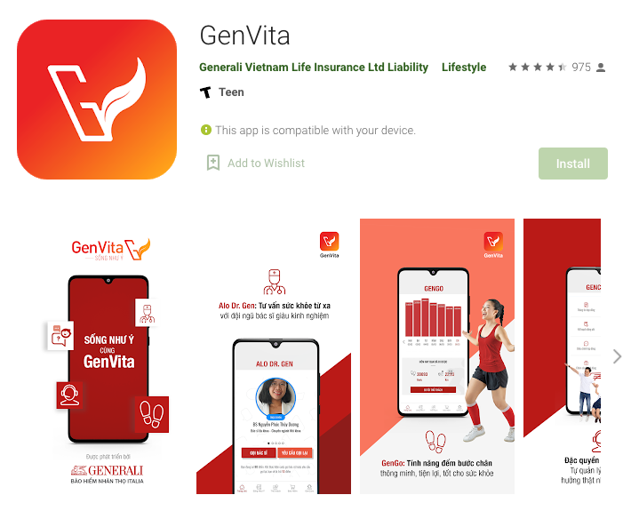

ID | Description
---|------------
Timeline | Mar 2018 - Jul 2018
Domain | Insurance
Delivery model | Offshore
Team size | 10 - 15 developers
Location | HCMC, Vietnam
Role | Tech Lead, React Native Developer
Links | [Web](https://genvita.vn/), [iOS](https://apps.apple.com/us/app/genvita/id1395692603), [Android](https://play.google.com/store/apps/details?id=com.generali.genvita&hl=en&gl=US)

Tech:
- React Native, Native Mobile
- Redux, React Navigation, Flow, i18n
- Functional JS, Ramda, Recompose,
- React Native Elements, Glamorous Native, Formik
- Unit Test, Sentry
- Docker, Gitlab CI/CD
- ESLint, Prettier
- Zeplin, REST APIs

Responsibilities:
* Core mobile app architecture
* Code convention
* Code review
* Team management
* Technical Documentation
* Continuous Delivery
* DevOps
* Technical training
* Work closely with other teams to resolve obstacles and speed up my team

Achievements:
* Lead a team of 10 developers to successfully build the first mobile app of the company using React Native
* Apply effectively functional programming principles & tools to a React Native project
* Improve code review
* Delegate work efficiently
* Integrate successfully Native modules to React Native codebase
