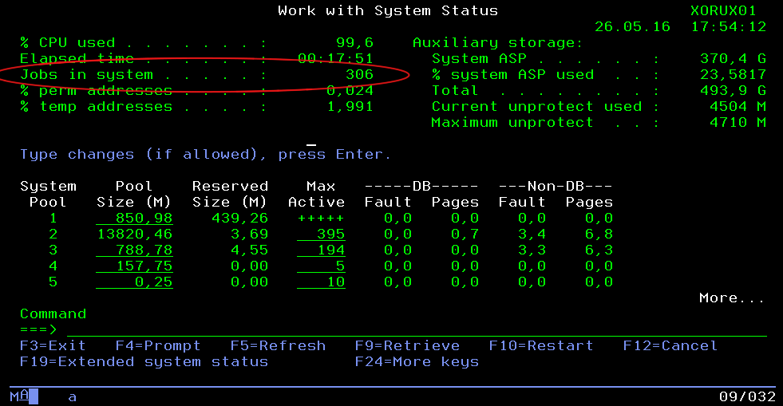

Info | Description
---|------------
Timeline | Dec 2010 – Jul 2012
Domain | Transport, Logistics
Delivery model | Offshore
Team Size | 20+ developers
Location | HCMC, Vietnam
Role | Application Developer

## Overview
GEODIS is a Supply Chain Operator ranking among the top companies in its field in Europe and the World.

This project develops core features and end-to-end solutions for logistics based on technologies in the IBM AS/400 system.

## Tech Stack
AS/400, CL, RPG, DB2, Adelia

## Highlights
- Work on application development using the Adelia programming language
- Customize compiled RPG and CL code
- Master the Adelia language in one month
- Conduct Adelia training sessions for new comers
