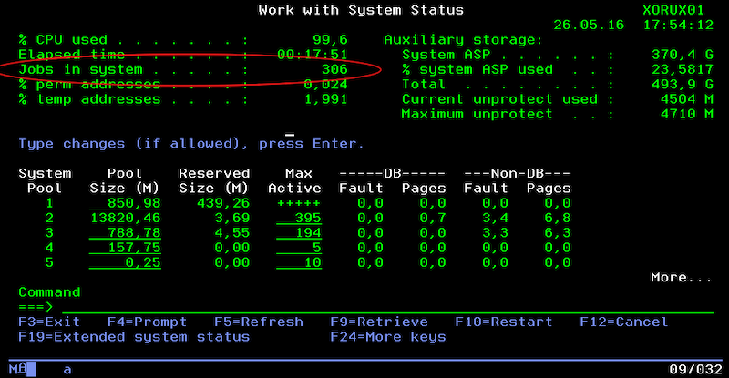

ID | Description
---|------------
Timeline | Dec 2010 – Jul 2012
Domain | Transport, Logistics
Delivery model | Offshore
Team Size | 20+ developers
Location | HCMC, Vietnam
Role | Application Developer

## Overview
GEODIS is a Supply Chain Operator ranking among the top companies in its field in Europe and the World.

This project develops core features and end-to-end solutions for logistics based on technologies in the IBM AS/400 system.

## Tech Stack
AS/400, CL, RPG, Adelia

## Responsibilities
- Development
- Maintenance
- Training (Adelia programming language)
