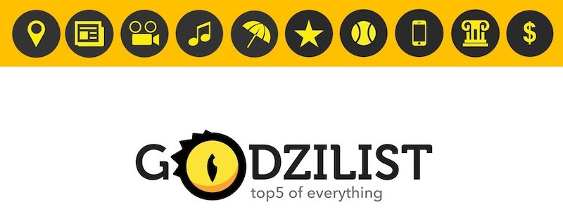

| ID             | Description                          |
| -------------- | ------------------------------------ |
| Timeline       | Feb 2015 – Dec 2015                  |
| Domain         | Advertising                          |
| Delivery model | Offshore                             |
| Team size      | 4 - 7 developers                     |
| Location       | HCMC, Vietnam                        |
| Role           | React Developer, FullStack Developer |

## Overview

Godzilist is a site that lists top5 of everything. User can also create his own top5 and share to his facebook friends. The site already exists in a basic beta, and the client wishes to improve it to launch. The improvement is made in a way that we can re-use a max of things already done.

## Tech Stack

- Node.js, Express.js, MongoDB, ElasticSearch, Jade template, GraphicsMagick, AWS, Redis
- JavaScript, React, SASS, Responsive design, jQuery, Grunt.js, Webpack, Facebook API, Bing API, i18n.
