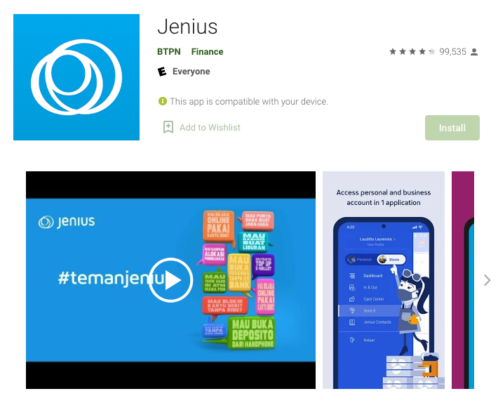

Info | Description
---|------------
Timeline | Feb 2017 - Mar 2018
Domain | Banking
Delivery model | Onsite
Team size | 50+ developers
Location | Jakarta, Indonesia
Role | React Native Developer
Links | [Web](https://www.jenius.com/), [iOS](https://apps.apple.com/id/app/jenius/id1079340119), [Android](https://play.google.com/store/apps/details?id=com.btpn.dc&hl=en&gl=US)

## Overview
From sending to saving money, paying the bills, comprehensive bank statements, to making deposits. Gone are the days where you go to the bank. You can do all your banking activities through your smartphone with Jenius.

## Tech Stack
- React, React Native, React Native Web
- Redux, React Navigation, i18n
- Jest, Enzyme, Codecov
- Webpack, ESLint
- REST APIs, Swagger, GraphQL, Microservices
- Docker, CI/CD, CircleCI, Buddy build, Amazon Web Services
- Gitlab, Github

## Highlights
- Work on Front-end development (Web, Mobile)
- Integration data with RESTful & GraphQL APIs
- Contribute to the documentation of coding standards
- Responsible for code reviews & writing testable code
- Discuss & resolve technical challenges across multiple teams
- Conduct team training & pair programming sessions
- Build a custom navigation to better support the web platform and optimize the performance for Android devices
- Successfully apply React Native Web to build a multi-platform app for both mobile and web using a single codebase

This is the biggest project I've ever worked on with more than **50** developers from all over the world, divided into 5 different squads.
