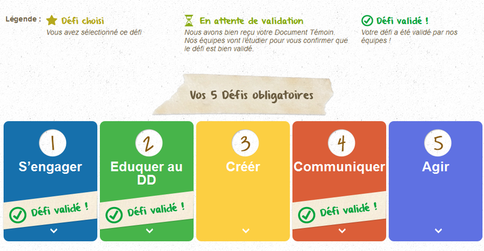

| Info           | Description                        |
| -------------- | ---------------------------------- |
| Timeline       | Jan 2013 – Jan 2015                |
| Domain         | Charity, Education                 |
| Delivery model | Offshore                           |
| Location       | HCMC, Vietnam                      |
| Role           | PHP Developer, FullStack Developer |

## Overview

A national project (France) where all participating schools will mobilize for 4 months to meet the 6 challenges around the lamp recycling that will electrify 4 village schools in developing countries:

- Pérou
- Burkina Faso
- Haïti
- Népal

## Tech Stack

- PHP, Wordpress, Web services.
- CoffeeScript, CSS3, Google Map API, GruntJS, HTML, jQuery.
