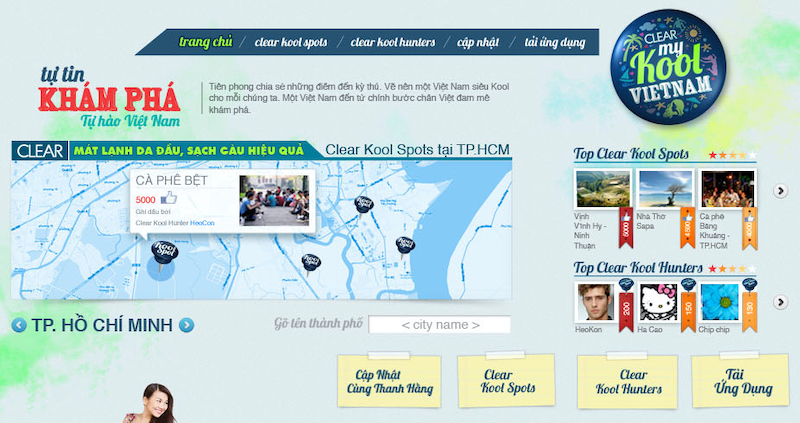

Info | Description
---|------------
Timeline | Jan 2014 – Apr 2014
Domain | Travel, Social Network
Delivery model | Offshore
Location | HCMC, Vietnam
Role | PHP Developer, FullStack Developer

## Overview
A cross-platform application (iOS, Android and website) that allows users to share their location and photos with friends through social networks wherever they travel across Vietnam.

## Tech Stack
- Drupal, Web services, Google map API, Facebook API
- HTML5, CSS3, Javascript, JQuery
