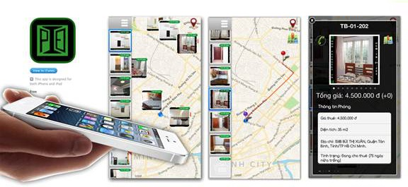

| Info           | Description                        |
| -------------- | ---------------------------------- |
| Timeline       | Oct 2010 – Feb 2012                |
| Domain         | Real Estate                        |
| Delivery model | Freelance                          |
| Location       | HCMC, Vietnam                      |
| Role           | PHP Developer, FullStack Developer |

## Overview

A web application to promote rooms for rent, manage customers, rental properties, reservations and invoices.

## Tech Stack

PHP, Symfony, HTML, CSS, Javascript, JQuery, Google Map API
