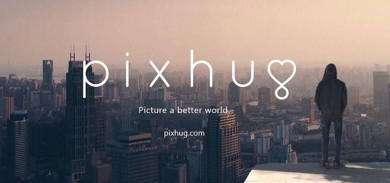

Info | Description
---|------------
Timeline | Jan 2015 – Mar 2015
Domain | Social Network, Advertising
Delivery model | Offshore
Team size | 6 developers
Location | HCMC, Vietnam
Role | Frontend Developer

## Overview
Pixhug is a social media platform for photo sharing. Developed around the idea of corporate sponsoring of humanitarian organizations, Pixhug adds value to social media interactions by raising awareness and funds for social causes.

## Tech Stack
JavaScript, Facebook API, Google API, Twitter API, CSS, jQuery, Image processing
