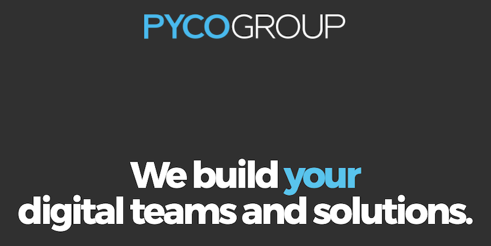

ID | Description
---|------------
Timeline | Jan 2016 – Mar 2016
Domain | Company Website
Delivery model | Offshore
Team size | 8 - 12 developers
Location | HCMC, Vietnam
Role | Frontend Developer

## Overview
This project aims to rebuild the Pyco Website in order to apply the new online identity of PYCOGROUP.
The top management has particularly insisted on:
- A mobile first approach
- A modern & simple Design & Content
- The new site should be used to communicate the Pyco Consulting Job Offer

## Tech Stack
- Back-end: Java, Magnolia
- Front-end: HTML5, CSS3, Responsive Design, SASS, Foundation, JavaScript
