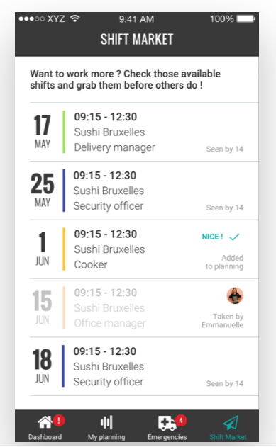

Info | Description
---|------------
Timeline | May 2016 – Aug 2016
Domain | Restaurant
Delivery model | Offshore
Team size | 8 - 15 developers
Location | HCMC, Vietnam
Role | Frontend Developer
Links | [Web](https://www.shiftmeapp.com/), [iOS](https://apps.apple.com/us/app/shiftmeapp/id1147122102), [Android](https://play.google.com/store/apps/details?id=com.shiftmeapp&hl=en_US&gl=US)

## Overview
The ShiftMe application is for both single and multi-unit location businesses.
It has been used as a restaurant/shop manager’s communication for shift/planning, and also open for later phases with more type of service providers.

Shift Me Application is a great tool for any business that has many moving parts that work together. You can keep track of things like planning as a group or individual, time off request, maintenance and repair Shift and user feedback.

## Tech Stack
- Backend: Spring MVC, Spring security by OWASP, Servlet Engine, Quarts, AWS SDK, JDA/Hibernate, OAuth 2.0, RESTful APIs
- Frontend: HTML5, CSS3, Angular 2.0, TypeScript
- Database: PostgreSQL, RDBMS
- Native Mobile Apps (iOS/Android)

## Highlights
- Work on frontend development using AngularJS
- Implement responsive web design for desktop, tablet and mobile
- Perform code view
- Integrate data with REST APIs
- Build an interceptor for the authentication
