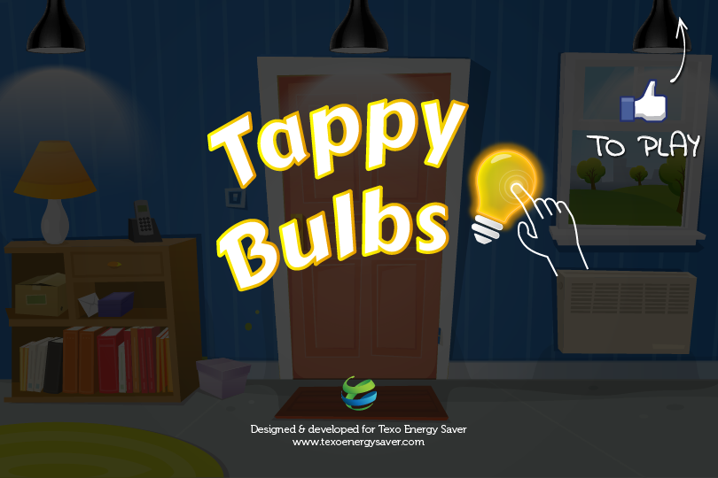

| Info           | Description          |
| -------------- | -------------------- |
| Timeline       | Oct 2014 – Nov 2014  |
| Domain         | Game                 |
| Delivery model | Freelance            |
| Location       | HCMC, Vietnam        |
| Role           | JavaScript Developer |

## Overview

A cross-platform game that is simple to play, tap on the Tappy Bulbs as fast as you can to turn them off! The trouble is that the Tappy Bulbs keep moving and so do the unlit bulbs and the light sockets!

## Tech Stack

HTML5, CSS3, Javascript, Facebook API, Web services
