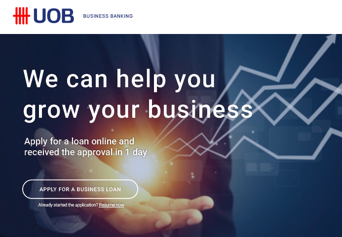

ID | Description
---|------------
Timeline | Aug 2016 – Dec 2016
Domain | Banking
Delivery model | Onsite
Team size | 6 - 10 developers
Location | Singapore
Role | React Developer

## Overview
The Business app provides small businesses with a single access to business and banking needs. It's designed to make all your banking needs safe, simple and convenient. You can also open business accounts online in just a few easy steps. Business loans can also be applied online with pre-approvals as fast as one business day.

## Tech
- JavaScript, React, React Router, Redux
- i18n, Phrase, Google Analytics
- REST APIs, Github, CI/CD, CircleCI
- Jest, Enzyme
- Zeplin

## Achievements
- First onsite project
- Work with talented people in an international environment
- Set up a ReactJS project from scratch
- First time applying Vim in a non-trivial project
- First time leading a team of 3 - 5 developers
- Work closely with staffs to complete the localization for the Vietnam market
