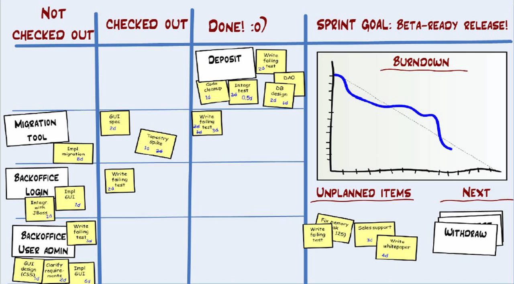

## Introduction
The author focuses on the way we actually do Scrum rather than explain the theories.
After learning Scrum and XP, he still has lots of questions to discuss.
Henrik believe that by turning principles and practices into his work, he can avoid typical Scrum mistakes.

Over one year, he experimented different ways of doing things (definitions of done, test-driven development, pair programming,..). He showed us one way to do Scrum well by continuously improving the process with a team of approximately 40 people. That maybe not the right way to do Scrum, but they are good practices to help us learn better how to do Scrum in our particular context.

## Distributed teams

## Scrum master checklist
Henrik lists common activities of a Scrum master.

- Beginning of sprint: Create a sprint page, include the sprint goal, update the sprint statistics, add your estimated velocity, team size, sprint length,...
- Every day: Start and end the daily scrum meeting on time, update the sprint backlog and burn down
- End of sprint: Do a sprint demo and retrospective, update the sprint statistics and key points from the retrospective

## Authors
[Henrik Kniberg](https://www.crisp.se/konsulter/henrik-kniberg) is a consultant at Crisp in Stockholm, specializing in Java and agile software development.

## References
1. Kniberg, Henrik. Scrum and XP from the Trenches - 2nd Edition. Lulu.com, 2015.
1. “Scrum and XP from the Trenches [Book Summary].” Binary.Com Company Blog, 5 Sept. 2015, https://blog.binary.com/scrum-and-xp-from-the-trenches-book-summary/.
1. Review: Scrum and XP from the Trenches by Henrik Kniberg. https://www.eyrie.org/~eagle/reviews/books/1-4303-2264-0.html. Accessed 19 Dec. 2020.
1. “Scrum and XP from the Trenches.” Pacroy.Github.Io, https://pacroy.github.io/scrum/. Accessed 19 Dec. 2020.
1. Scrum Checklist | Crisp. https://www.crisp.se/gratis-material-och-guider/scrum-checklist. Accessed 19 Dec. 2020.

